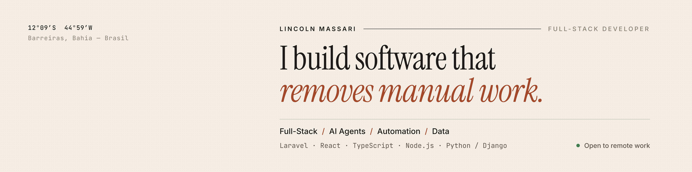

## Hi, I'm Lincoln 👋

Full-stack developer focused on **automation and AI agents**. I build products end to end — database, API, UI — and I like the kind of software that quietly takes repetitive work off people's plates.

Today I lead development at a consulting firm in Brazil: I own the company's core platform, ship new products from zero to production with **Laravel + React**, and build **Python RPA bots and AI agents** that automate checks against government systems. Before that I worked in data analytics (Power BI on AWS) for agribusiness.

Open to **remote** full-stack and AI engineering roles · English (fluent) · Portuguese (native) · UTC−3

---

### Featured projects

**[CNPJ Due Diligence Agent](https://github.com/lincolnjesuino-cmyk/cnpj-due-diligence-agent)** — **[▶ live demo](https://lincolnjesuino-cmyk.github.io/cnpj-due-diligence-agent/?demo)** 
An AI agent (Claude API) that runs KYB / vendor due diligence on Brazilian companies using official public data. It follows the ownership chain into shareholder companies and streams a sourced risk report.
- Facts and risk score come from code; the LLM only writes the narrative — no hallucinated facts
- Deterministic, unit-tested risk engine · strict tool schemas · structured outputs
- Behavioral evals, 39 automated tests, CI, Docker · Python · FastAPI · React · TypeScript

**[Brazil Crop Atlas](https://github.com/lincolnjesuino-cmyk/brazil-crop-atlas)** — **[▶ live site](https://lincolnjesuino-cmyk.github.io/brazil-crop-atlas/)** 
An interactive atlas of municipal crop production in Western Bahia — one of the world's largest grain frontiers — on 25 years of IBGE open data.
- Laravel API with an idempotent importer, area-weighted analytics and versioned caching
- React + TypeScript dashboard: choropleth map, rankings, trends, accessible table view, dark mode
- Data refreshes itself monthly via GitHub Actions · 32 automated tests · Docker · PHP · Laravel · React · TypeScript

---

### Tech I work with

**Back end:** PHP / Laravel · Python / Django / FastAPI · Node.js · REST APIs · SQL 
**Front end:** React · TypeScript · PWAs 
**AI & automation:** LLM agents (tool use, structured outputs, evals) · RPA with Python 
**Data & cloud:** Power BI · AWS · Docker · GitHub Actions

---

📫 **[LinkedIn](https://www.linkedin.com/in/lincolnmassari)** — the best way to reach me.
